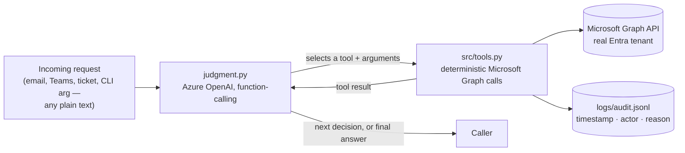
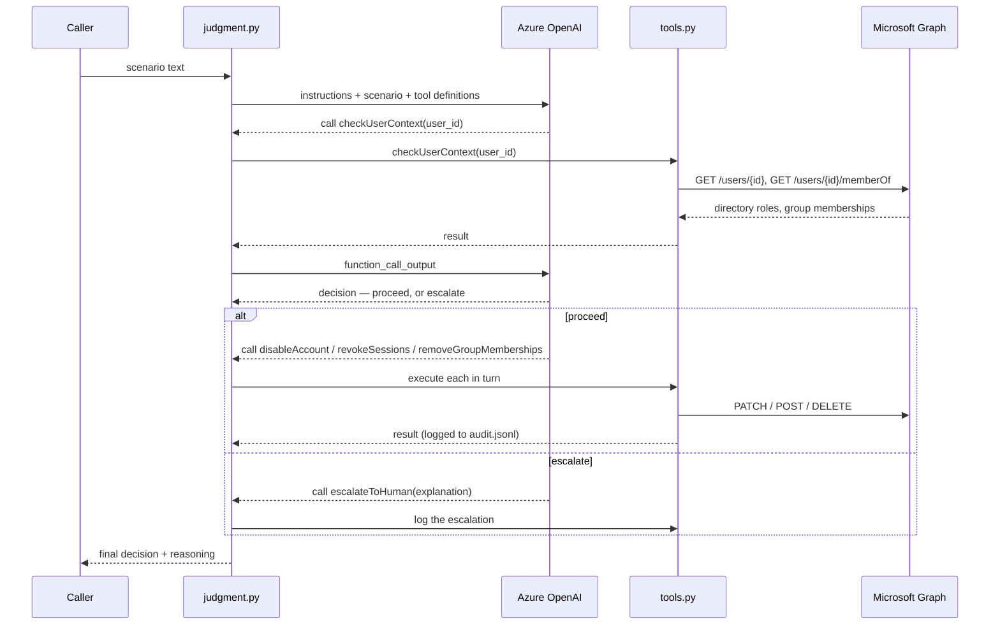
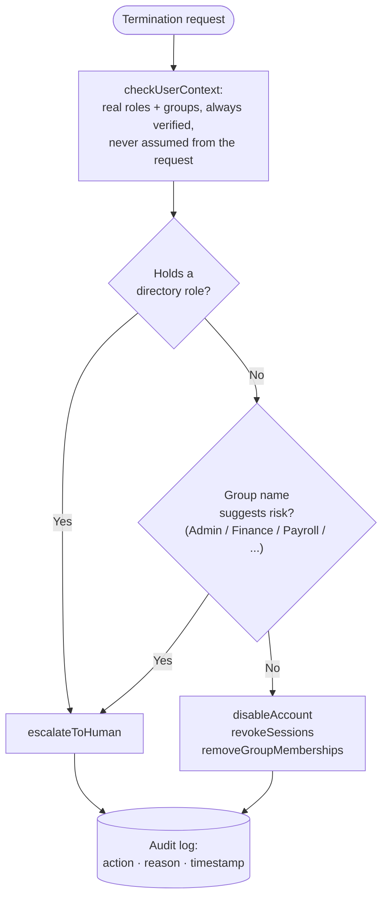

# Entra Automation Agent

An AI agent that automates Microsoft Entra ID (Azure AD) identity operations —
offboarding and access requests — with a real LLM judgment layer deciding
whether to act automatically or escalate to a human, not a hardcoded rule set.

## Why this exists

Most "automate offboarding" scripts are a fixed sequence: disable, revoke,
remove groups, done. That's fine until someone terminated happens to hold a
Global Administrator role, or belongs to a group your script's author never
thought to check for. This project separates the two concerns properly:

- **A deterministic core** (`src/tools.py`) — the actual Microsoft Graph API
  calls (disable account, revoke sessions, remove group memberships, add
  group membership, look up directory roles). Fixed, tested, boring on
  purpose. Nothing here is probabilistic.
- **An LLM judgment layer** (`judgment.py`) — decides *whether* to run those
  actions, using real-time context it looks up itself (never trusting an
  unverified claim in the incoming request), and explains its reasoning in
  the audit log. This is the part that actually earns the word "agent."

The LLM never generates or executes its own code against a real identity —
it can only select from a fixed set of tools, each backed by tested
deterministic code. That boundary is deliberate.

## Architecture



The LLM layer is intentionally decoupled from *how* a request arrives —
`run_judgment()` just takes a plain-text scenario. Whether that text comes
from a CLI arg, a mailbox listener, or a Teams bot is a separate, pluggable
concern that doesn't touch the judgment engine itself.

### The orchestration loop



### Offboarding decision flow



### Tools available to the model

| Tool | Purpose | Key parameters |
|---|---|---|
| `checkUserContext` | Look up a user's real directory roles and group memberships. Always called first — never trusts an unverified claim in the request. | `user_id` |
| `disableAccount` | Disable the Entra ID account. | `user_id`, `reason` |
| `revokeSessions` | Revoke all active sign-in sessions. | `user_id`, `reason` |
| `removeGroupMemberships` | Remove the user from all current group memberships. | `user_id`, `reason` |
| `requestAccess` | Add a user to a specific group as an approved access request. | `user_id`, `group_name`, `reason` |
| `escalateToHuman` | Stop and hand off to a human reviewer instead of acting automatically. | `user_id`, `explanation` |

Each tool call and its result — including tool failures, like a group name
that doesn't exist — is fed back to the model, so it can recover gracefully
(ask for clarification, try a different approach) instead of the whole
process crashing on the first unexpected response.

## What it actually handles

- **Offboarding**: given a terminated user, looks up their real directory
  roles and group memberships, then either proceeds (disable account, revoke
  sessions, remove group memberships) or escalates to a human — e.g., if
  they hold a directory role or belong to a group whose name suggests
  elevated risk.
- **Access requests**: given a user and a target group, either grants the
  membership or escalates if the group name looks sensitive (admin/finance/
  payroll-sounding) or the request is ambiguous.

Both run through the same engine, the same tool-calling pattern, and log to
the same audit trail.

## Setup

```bash
python3 -m venv .venv
source .venv/bin/activate
pip install -r requirements.txt
cp .env.example .env
```

Fill in `.env`:

- `GRAPH_TENANT_ID`, `GRAPH_CLIENT_ID`, `GRAPH_CLIENT_SECRET` — an Entra app
  registration in your tenant with **Application** (not Delegated) permissions:
  `User.ReadWrite.All`, `GroupMember.ReadWrite.All`, `Directory.Read.All`,
  with admin consent granted.
- `AZURE_OPENAI_ENDPOINT`, `AZURE_OPENAI_DEPLOYMENT` — an Azure OpenAI
  resource with a deployed model (`gpt-4o-mini` or `gpt-4.1-mini` work well;
  this task is structured judgment, not deep reasoning, so a smaller/cheaper
  model is the right call, not a limitation). Auth is via
  `DefaultAzureCredential` (your `az login` session) — no API key needed.

**Test against your own tenant first with a disposable sandbox**, not
production identities — this genuinely disables accounts and changes group
memberships. Copy `test_scenarios.example.py` to `test_scenarios.py` (already
gitignored) and fill in real users/groups from your sandbox.

## Usage

```bash
python judgment.py "employee@yourtenant.onmicrosoft.com has just been terminated. Please offboard them."
python judgment.py "employee@yourtenant.onmicrosoft.com needs to be added to the Marketing group."
```

Deterministic-only entry points (no LLM, for testing the core actions in
isolation) are also available:

```bash
python main.py someone@yourtenant.onmicrosoft.com              # offboarding, dry-run
python main.py someone@yourtenant.onmicrosoft.com --execute     # actually perform it
python main_access.py someone@yourtenant.onmicrosoft.com "Group Name" --execute
```

Every real action is logged to `logs/audit.jsonl` with a timestamp, actor,
and the specific reason (AI-generated when going through `judgment.py`, not
a canned string).

## Testing

```bash
python test_judgment.py
```

Runs each scenario in `test_scenarios.py` multiple times (LLM output has
some run-to-run variance) and checks pass/fail based on which tools were
*actually* invoked — not just whether the final text sounds right.

## Deploying the tool API (optional)

`api.py` wraps the deterministic tools as a FastAPI app; `function_app.py`
lets it run as an Azure Function (useful if you want the tools reachable
over HTTP for some other integration). Not required to run `judgment.py`
itself, which calls the tool functions directly in-process.

## Project structure

```
judgment.py                  LLM judgment layer - instructions, tool
                              definitions, orchestration loop
src/graph_client.py           Thin Microsoft Graph API wrapper + MSAL auth
src/tools.py                  Deterministic actions (the only code that
                              actually touches a real identity)
main.py                       Offboarding, deterministic-only (no LLM),
                              for testing the core actions in isolation
main_access.py                 Access requests, deterministic-only
test_judgment.py               Automated test harness for the judgment layer
test_scenarios.example.py      Template - copy to test_scenarios.py (gitignored)
api.py                        Optional FastAPI wrapper exposing the tools
                              over HTTP
function_app.py                Optional Azure Functions entry point for api.py
```

## Real problems hit building this (kept here on purpose)

- **A hosted "Agent Service" framework (tool-calling via a platform UI)
  silently never invoked any tool**, across multiple models, instruction
  rewrites, and republishes — confirmed via server-side request logs
  showing zero inbound calls, while the model confidently narrated having
  done things it never did. No error, no warning. Switched to calling the
  model directly and orchestrating tool execution in our own code, which
  is fully inspectable and actually works. Lesson: a platform abstraction
  that "just works" is worth verifying against a server-side log, not the
  chat transcript, before trusting it.
- **Microsoft Graph's `/groups/{id}/members/{id}/$ref` requires the actual
  object ID, not a UPN** — unlike `/users/{id}`, which accepts either. The
  model would pass through whatever identifier it was given; fixed by
  resolving to an object ID defensively in the tool code itself, rather
  than relying on prompting to get the format right every time.
- **A model correctly identified a request as high-risk in its own stated
  reasoning, then called the wrong tool anyway** (granted access instead of
  escalating). Fixed by making the instruction an explicit hard constraint
  ("you MUST NOT call X for anything meeting this bar") rather than a
  softer guideline — verified fixed across repeated trials, not just once.
- **Re-running an idempotent action threw an error instead of a no-op**
  (removing a group membership that was already removed). Real automation
  needs to tolerate being re-run against already-completed work.

## License

MIT — see [LICENSE](LICENSE).
